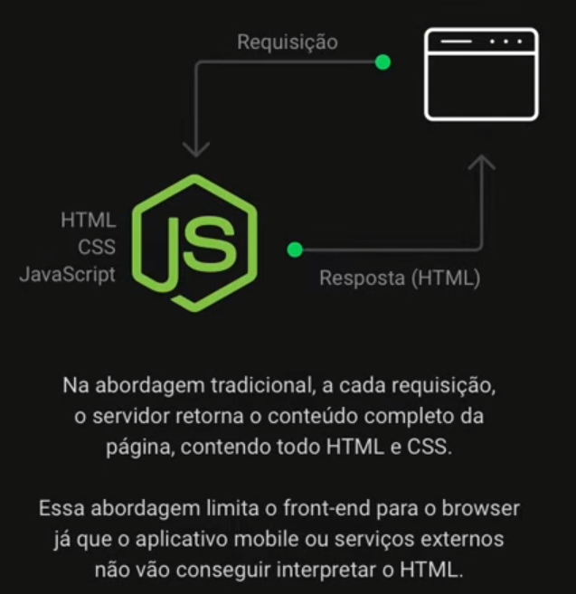
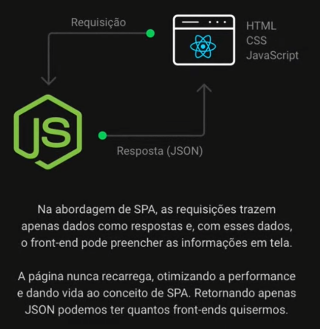
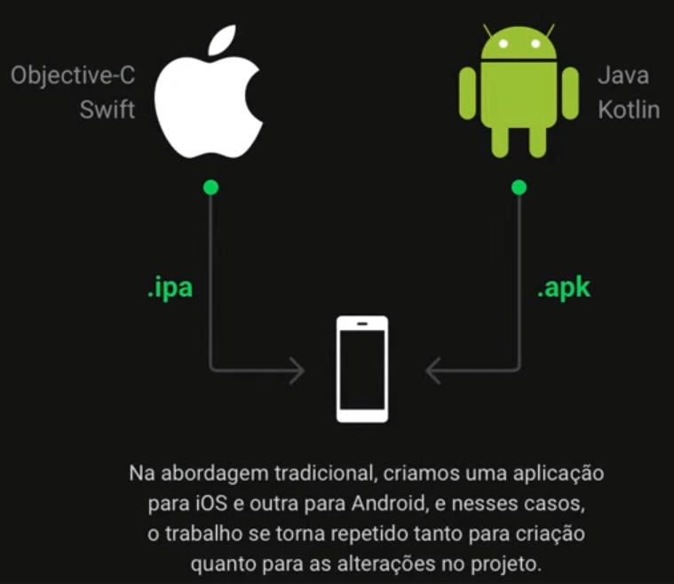
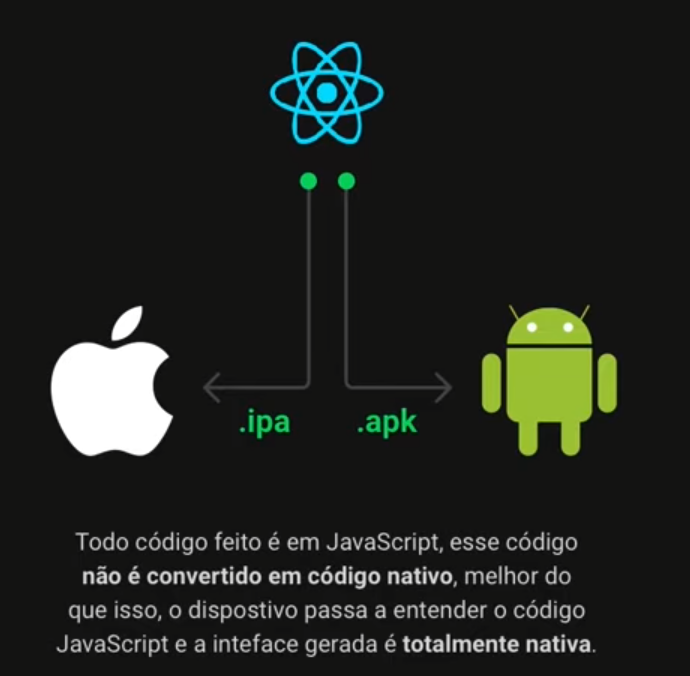
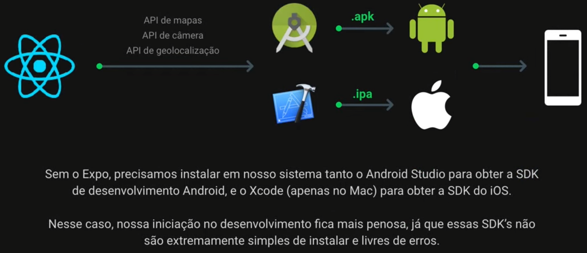
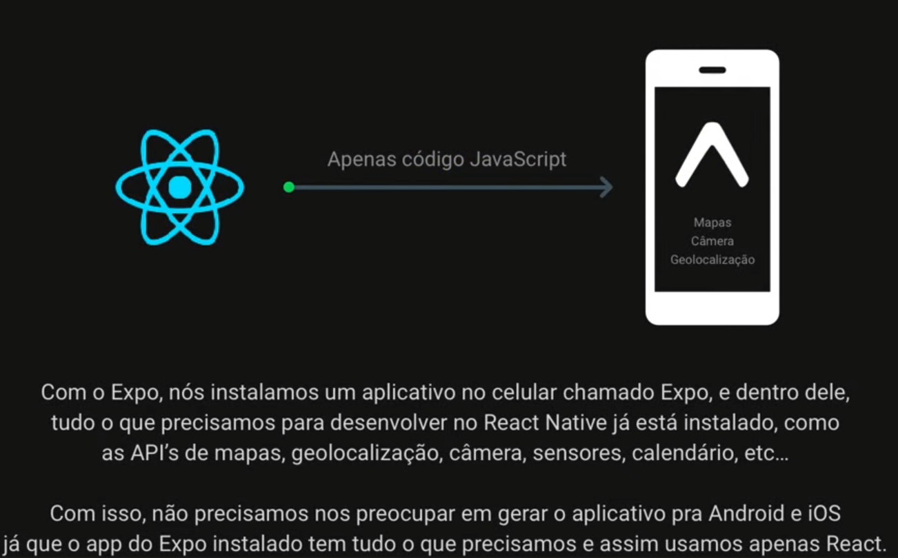

# Primeiro dia

- Apresentar aplicação
- Configurar ambiente de desenvolvimento
    - Node.js & NPM
    - Visual Studio Code
- Entender sobre back-end e front-end
- Criar projeto com Node.js
- Entender sobre React & SPA
- Criar projeto com ReactJS
- Entender sobre React Native & Expo

Construiremos uma API RESTful

## Configurar ambiente de desenvolvimento

- Instalar node
    - OBS: se baixar NVM ( Node Version Manager), tanto o node.js quanto o npm (Node Package Manager) já serão instalados junto
    - Instalar o nvm --> https://www.freecodecamp.org/news/node-version-manager-nvm-install-guide/
    - Instalar node utilizando o nvm --> https://heynode.com/tutorial/install-nodejs-locally-nvm/
    - Instalando dessa maneira, tanto o Node quanto o npm já serão instalados

## Entender sobre Back-End e Front-End

Back-end (Nosso caso --> node.js)
- Aquilo que o usuário não vê
- O que está por trás da aplicação
- Regras de negócio
- Conexão banco de dados
- Envio de e-mail
- Comunicação com webservices
- Autenticação do usuário
- Criptografia e segurança
- Back-end fornece informações para algum cliente (navegador, aplicativo, outra aplicação)

Front-end (Nosso caso --> react ou react native)
- Aquilo que o usuário vê
- Recebe os dados do back-end
- Serviços externos

Back-end deve se comunicar com o Front-end
- Comunicação é realizada através de JSON
- JSON (Javascript Object Notation) é uma estrutura de dados

## Criar projeto com node.js

- Criar uma pasta "backend" para criar o projeto com node.js
- Comando "npm init -y"
- Isso criará o arquivo package.json
    - Contém informações e configurações do nosso projeto
    - Contém as DEPENDÊNCIAS (bibliotecas de terceiros) que nós instalamos no nosso projeto
- Instalar o módulo express "npm install express"
- Isso criará o diretório node_modules
    - Contém o código fonte dos módulos que instalamos e as dependências desses módulos

Iniciando o código
- Criar arquivo "index.js"
    - Arquivo principal da aplicação
    - Todo código da aplicação parte desse arquivo

Executando a aplicação
- Uma vez criado e codado o arquivo index.js, podemos executar nossa aplicação
- Comando "node index.js"
- "localhost:3333" no navegador acessaremos nossa aplicação

## Entender sobre React & SPA

### Abordagem Tradicional

### Abordagem SPA (Single-Page Applications)

## Criar projeto com ReactJS

- Comando "npx create-react-app frontend"
    - npx é parecido com npm, mas ele executa um pacote externo sem a necessidade de instalar esse pacote na nossa máquina

Executando o front-end
- Dentro da pasta "frontend"
- Comando "npm start"
    - Uma página será aberta na porta 3000
    - Essa página renderizada é dada pelo arquivo "App.js"

## Entender React Native & Expo

### Abordagem tradicional

### Abordagem do React Native

### Por que utilizar o Expo?

Expo
- É um framework para React Native
- Conjunto de ferramentas/bibliotecas prontas para utilizar a maioria das funcionalidades do celular (mapas, câmera, gelocalização, etc)

Exemplo de aplicação sem o Expo:

Exemplo de aplicação com o Expo:

